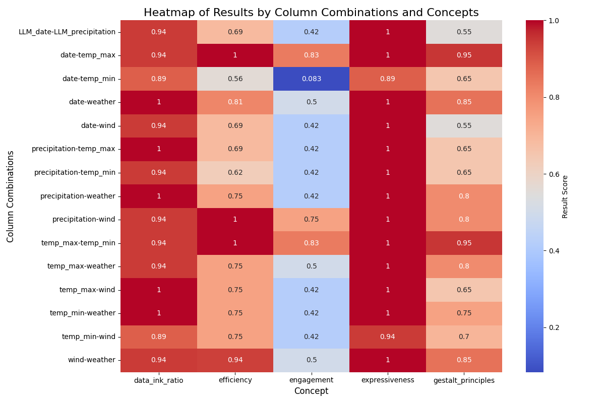

# Combining logic programming with LLMs for visualization recommendation

This project explores the integration of **Draco2**, a logic programming framework for visualization design, with a **Large Language Model (LLM)** for generating and evaluating chart recommendations. The ultimate goal is to recommend expressive and effective visualizations based on the given data, leveraging the strengths of both logic programming and AI.

## Contents

- [Introduction](#introduction)
- [Principles of Visualization](#principles-of-visualization)
  - [Expressiveness](#expressiveness)
  - [Efficiency](#efficiency)
  - [Engagement](#engagement)
  - [Data Ink Ratio](#data-ink-ratio)
  - [Gestalt Principles](#gestalt-principles)
- [Novel Evaluation Method](#evaluation-method)
- [Results](#results)
- [How to Run](#how-to-run)
  - [Local Installation (attention to step 3)](#local-installation)
  - [Using Docker](#using-docker)
- [Repository Structure](#repository-structure)
- [References](#references)

---

## Introduction

This project implements an automated pipeline for visualization recommendation, using the following tools:
- **Draco2**: A constraint solver to recommend visualizations in **Vega-Lite** format.
- **LLM (Gemini API)**: Used to identify relevant columns for visualization from a dataset.
- **Evaluation Metrics**: Combined evaluation using multimodal LLMs and Draco's scoring system, which accounts for soft constraint violations. In more detail, method is described bellow.
- **Dataset**: The dataset used is the **weather dataset** from Vega-Lite.

---

## Principles of Visualization
Before we start to dive into how the Evaluation was done, I need to bring in lights few terms and principles that are going to be used in further explanations, and which are going to be used for evaluation of the generated visualizations.

#### Expressiveness
Expressiveness pertains to the extent to which a visualization accurately represents the underlying data and relationships. An expressive visualization ensures that all relevant information is depicted without distortion or omission, enabling viewers to interpret the data's true meaning. This includes choosing the right type of chart or graph that aligns with the data's characteristics and the message intended to be communicated.

#### Efficiency
Efficiency in data visualization refers to the ability of a visual representation to convey information quickly and accurately to the viewer. An efficient visualization minimizes cognitive load, allowing users to grasp insights without unnecessary effort. This involves clear design, appropriate use of visual elements, and elimination of superfluous details that do not contribute to understanding the data.

#### Engagement
Engagement refers to the capacity of a visualization to capture and maintain the viewer's attention. An engaging visualization is aesthetically pleasing, interactive (when appropriate), and resonates with the audience, encouraging exploration and deeper understanding. While engagement is important, it should not compromise clarity or accuracy; the primary goal remains effective communication of data.

#### Data-Ink Ratio 
The data-ink ratio is a concept introduced by Edward Tufte, emphasizing the proportion of a visualization's ink dedicated to displaying actual data compared to the total ink used. A high data-ink ratio means that most of the ink contributes to conveying information, with minimal use of non-essential decorative elements. Maximizing the data-ink ratio involves removing unnecessary gridlines, backgrounds, and embellishments that do not enhance understanding, thereby creating a cleaner and more interpretable visualization.

#### Gestalt Principles
Gestalt principles, originating from psychology, describe how humans naturally perceive visual elements as organized patterns or wholes, rather than as separate components. These principles are crucial in data visualization, as they guide the design of graphics that align with innate human perception, thereby enhancing clarity and comprehension.

**Key Gestalt Principles in Data Visualization**:

- Proximity: Elements that are close to each other are perceived as related or part of a group. In visualizations, clustering related data points together can indicate their association.

- Similarity: Objects sharing similar attributes (e.g., color, shape, size) are seen as part of the same group. Consistent use of colors or shapes to represent similar data categories leverages this principle.

- Enclosure (Common Region): Elements enclosed within a boundary are perceived as a group. Using backgrounds or borders to enclose related data points can effectively indicate grouping.

- Closure: The mind tends to perceive complete shapes even when parts are missing. Designing visualizations that suggest familiar forms can help viewers fill in gaps and understand the data more intuitively.

- Continuity: Elements arranged on a line or curve are perceived as more related than those not on the path. Aligning data points along a clear line can suggest a relationship or trend.

- Common Fate: Elements moving in the same direction are perceived as a group. In animated visualizations, data points that change together can indicate a shared relationship.

- Figure-Ground: The mind separates visual fields into the main object (figure) and the background (ground). Ensuring a clear distinction between data (figure) and background enhances focus and understanding.

All principles listed above can be used to fully evaluate our visualization. When we say fully we mean that cover all aspects of visualization, not only from perspective of data (like Efficiency and Expressiveness), but also from the side of the design (like Gestalt Principles and Data-Ink ratio).

---

## Evaluation Method
Before we are going to talk about evaluation we need to know which system we are going to evaluate, therefore, bellow, I provide a concise explanation of how the system is working.

My system works in the following way: First, through LLM we choose the columns, my approach relies on the Gemini-1.5 Model from Google (Google I am sorry, I use it only for research purposes), this model is prompted with the information about the data itself, so we tell the model general characteristics of the data which we can obtain directly from running `df.info()` function, then we just ask the model to choose two columns that are going to result in the **BEST** visualization. (Later we will go back to this: "BEST" word). 

Second, after we have columns that we want to visualize, at the same time we obtain the data schema from Draco2, and therefore we can now pass it to constrain solver, which is going to return us design space in which we just choose the first and the best chart from the solver (has the lowest draco_score). 

Good, now we have visualization for our chosen columns, and at the same time we can generate visualizations for all combination of columns and see and compare the results. [Here is the visualization that we have by using the columns from the LLM choice](./assets/LLM_date+LLM_precipitation+12.png) (You also can see in on the left bellow). Right next to the date-precipitation chart(LLM chosen columns) we can see another good example of generated chart.

<p align="center">
  
  
</p>

Good, right now we have columns, we have charts, and we have draco_score for this charts, for example few charts that are shown above, have exactly the same draco score, and this can be seen [here](#results). However we see that the charts are different and they deliver different insights and information, so how can we evaluate and compare this charts? 

Therefore time has come to introduce you new evaluation method (probably there is already something similar, but i didn't manage to find, one work that was close to this method is work from [these guys](https://www.researchgate.net/publication/344084728_How_to_evaluate_data_visualizations_across_different_levels_of_understanding) but I made some inventions from my side)

To begin with, how do we understand that the following visualization(like one from the above) complies with for example Efficiency principle? We know the definition, we see the visualization, but how do we come to the conclusion that this one does or doesn't comply with Efficiency principle, or how well does it comply, to what extent? I decided to go into our thought process, and I came up with the conclusion, that we sort of answering simple and specific questions that we derive by ourself, once we have seen the definition of the principle. Let me elaborate...

Efficiency - "refers to the ability of a visual representation to convey information quickly and accurately to the viewer. An efficient visualization minimizes cognitive load, allowing users to grasp insights without unnecessary effort. This involves clear design, appropriate use of visual elements, and elimination of superfluous details that do not contribute to understanding the data." [Evaluating the Effectiveness and Efficiency of Visual Variables](https://link.springer.com/chapter/10.1007/978-3-642-03832-7_12#Abs1). 

By knowing the definition and the task (in our case it is data exploration) we can derive sort of questions, and answering those we can understand how the following visualizations comply with Efficiency principle. For example: "Can the main trends or patterns be understood within a few seconds when looking at this visualization?". By creating multiple questions that touch different aspects of the definition of the principle and by making the questions easy and binary (the answer is "yes" or "no" where answer "no" always represents that one of the visualization's aspect is not good according to this principle), we can obtain list with "yes" and "no" answers. Then those "yes" and "no" can be converted in 1's and 0's respectively (for more smooth judgments I introduced 0.5 if the model cannot derive the answer clearly), and therefore we can count the mean and obtain the score. The scores can be seen in the [Results](#results)

So far so good, and the sweetest part is that Multi-modal LLMs can answer this sort of questions - when we input the visualization picture in the prompt as well. How reliable this method of evaluation? Honestly, it's difficult to answer this question... But I will give a try! I have a list with 8 questions and I have to visualization, my own judgment came to the following numbers: Talking about Efficiency - 0.75 for the chart on the left above (LLM - date - precipitation), - 1 for the chart at the right (wind - precipitation). As we can see, my manual judgments did align good but only for the Efficiency Principle, in future I would like to check for the rest of the Principles (especially Expressiveness!). The method is raw and seeks improvements, however I see future potential of this methods especially because we can fine-tune the LLMs and narrow them down for this specific purpose. I hope that someone finds this repository useful for their research in this field!

---

## Results




On the above results we can notice the following: 
- Columns generated by LLM results in the best Draco score, however according to other metrics, we can notice that Precipitation and Wind columns can result in graph with higher efficiency, engagement, and have higher score on the Gestalt Principles. Therefore we can say that the LLM can choose better combination of columns.

---


## How to Run

This section provides instructions for running the project locally or using Docker.

### Local Installation

1. **Clone the Repository**:
   ```bash
   git clone https://github.com/AlexRaudvee/Visualisations-Recomendations-Draco-LLMs
   cd Visualisations-Recomendations-Draco-LLMs
   ```
2. **Set Up a Python Environment**:
    - Create and activate a virtual environment:
    ```bash 
    python3 -m venv venv
    source venv/bin/activate   # For Windows: venv\Scripts\activate
    ```
    - Install dependencies:
    ```bash
    pip install -r requirements.txt
    ```
3. Run the Script:
    - Configure the config.json file with your Gemini API key and Draco setup details. **Remember that you will need to add `private.py` file with the GOOGLE_API variable**
    - Execute the main script:
    ```bash
    python main.py
    ```
    
### Using Docker
1. Create a `private.py` file in which you will specify the `GOOGLE_API` variable - should be one of the API keys for Gemini model.
2. Build the Docker Image:
```bash
docker build -t visualization-recommender .
```
3. Run the Container:
```bash
docker run -it visualization-recommender
```

## Repository Structure
```plaintext
.
├── data/                  # Input datasets
├── assets/                # Generated visualizations and evaluation outputs
├── functions/           
│   ├── functions.py       # All the functions with documentations for them
│   ├── __init__.py        # Init file which allows to import from functions
├── main.py                # Main execution script
├── config.py              # Configurations file
├── requirements.txt       # Python dependencies
├── dockerfile             # Docker configuration
├── .gitignore             # gitignore file
├── private.py             # This file you have to create with API key for the Gemini model
├── LICENSE.md             # License file
└── README.md              # Project documentation
```

## References
- Draco Documentation
- Vega-Lite Documentation
- Gestalt Principles in Data Visualization
- Expressiveness in Visualization